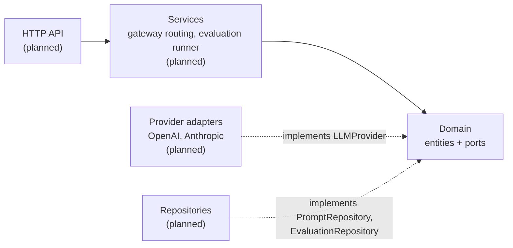

# llm-gateway-eval

A provider-agnostic LLM gateway with a built-in prompt evaluation suite, written in Go.

The gateway puts OpenAI and Anthropic behind a single request/response contract with fallback between providers. The evaluation suite versions prompt templates, replays test cases against every version, and records the results so regressions are visible before a prompt change ships.

> **Status: early development.** Only the domain layer exists today. Provider adapters, persistence, the evaluation runner and the HTTP API are not implemented yet. See the [roadmap](#roadmap).

## Why

Prompts are code, but they rarely get the same treatment: no versions, no tests, no record of which template produced which output. Separately, calling a single LLM vendor directly leaves an application exposed to that vendor's outages and rate limits.

This project addresses both in one service:

- **One contract, several vendors.** Callers send an `LLMRequest`; adapters translate it into each vendor's payload and normalise the response (finish reasons, token usage, latency).
- **Fallback on retryable failures.** Upstream errors carry a `Retryable` flag (timeouts, 429s, 5xx) so the routing layer can decide whether to try the next provider.
- **Immutable prompt versions.** Every change to a template, system prompt, model or sampling parameter creates a new numbered version.
- **Regression testing for prompts.** Test cases belong to the prompt, not to a version, so the same suite runs against every version.
- **Traceable results.** Each result records the exact prompt version, the provider and model that actually served it, token usage and latency.

## Architecture

The project follows Clean Architecture. The domain package is the innermost ring: it depends only on the standard library and defines the ports that outer layers implement.



### Domain model

| Type | Purpose |
| --- | --- |
| `LLMRequest` / `LLMResponse` | Provider-agnostic completion request and result |
| `ModelParameters` | Sampling settings (`temperature`, `top_p`, `max_tokens`, `stop`) |
| `ProviderError` | Upstream failure with HTTP status and a `Retryable` flag |
| `Prompt` | Named prompt with descriptive metadata |
| `PromptVersion` | Immutable snapshot: template, system prompt, provider, model, parameters |
| `EvaluationTestCase` | Template variables plus an expected output and a match strategy |
| `EvaluationResult` | Outcome of one test case against one prompt version |

### Ports

| Interface | Implemented by |
| --- | --- |
| `LLMProvider` | One adapter per vendor |
| `PromptRepository` | Storage for prompts and their versions |
| `EvaluationRepository` | Storage for test cases and results |

All validation errors wrap `ErrInvalidInput`; repositories return errors wrapping `ErrNotFound` or `ErrConflict`. Transports can branch on these with `errors.Is`.

## Prompt templates

Templates use Go's [`text/template`](https://pkg.go.dev/text/template) syntax and are rendered with a `map[string]string` of variables:

```go
v := &domain.PromptVersion{
    PromptID:     "p1",
    Version:      1,
    Template:     "Summarise the following text:\n{{.text}}",
    SystemPrompt: "You are concise.",
    Provider:     domain.ProviderAnthropic,
    Model:        "claude-sonnet-5-5",
    Parameters:   domain.ModelParameters{MaxTokens: 256},
}

req, err := v.BuildRequest(map[string]string{"text": "Go is a compiled language..."})
```

Referencing a variable that is missing from the map is an error, not a silent `<no value>`, so a typo in a template fails loudly instead of producing a misleading evaluation.

## Match strategies

| Strategy | Passes when |
| --- | --- |
| `exact` | The trimmed output equals the trimmed expectation (case-sensitive) |
| `contains` | The output contains the expectation (case-insensitive) |
| `regex` | The output matches the expectation as a regular expression |

```go
tc := &domain.EvaluationTestCase{
    PromptID:       "p1",
    Name:           "returns a year",
    Variables:      map[string]string{"text": "..."},
    ExpectedOutput: `^\d{4}$`,
    MatchStrategy:  domain.MatchRegex,
}

passed, err := tc.Matches("2024") // true
```

## Getting started

Requires Go 1.24 or later. There are no third-party dependencies.

```bash
git clone git@github.com:mustafajarrah/llm-gateway-eval.git
```

```bash
go test ./...
```

There is no runnable binary yet.

## Project layout

```
internal/
  domain/
    doc.go       package overview
    errors.go    sentinel errors
    llm.go       gateway entities and the LLMProvider port
    prompt.go    prompts, versions, test cases, results and repository ports
```

## Roadmap

- [x] Domain entities, validation and ports
- [ ] OpenAI and Anthropic provider adapters
- [ ] Gateway routing with retries and provider fallback
- [ ] Repository implementation
- [ ] Evaluation runner (execute a suite against a prompt version)
- [ ] HTTP API
- [ ] CI (vet, test, lint)

## License

[MIT](LICENSE)
