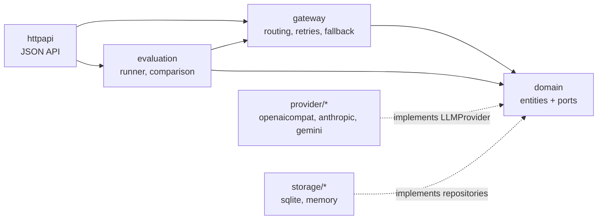

# llm-gateway-eval

A provider-agnostic LLM gateway with a built-in prompt evaluation suite, written in Go.

The gateway puts several LLM vendors behind a single request/response contract, with retries and fallback between providers. The evaluation suite versions prompt templates, replays test cases against every version, and records the results so regressions are visible before a prompt change ships.

> **Status: working, not yet battle-tested.** Everything described here is implemented and covered by tests, but the provider adapters have only been exercised against local fake servers, never against the real vendor APIs. See [what is not done yet](#roadmap).

## Why

Prompts are code, but they rarely get the same treatment: no versions, no tests, no record of which template produced which output. Separately, calling a single LLM vendor directly leaves an application exposed to that vendor's outages and rate limits.

This project addresses both in one service:

- **One contract, several vendors.** Callers send one request shape; adapters translate it into each vendor's payload and normalise the response (finish reasons, token usage, latency).
- **Retries and fallback.** Transient failures are retried with backoff; a named route falls back from one provider to the next, each with its own model.
- **Immutable prompt versions.** Every change to a template, system prompt, model or sampling parameter creates a new numbered version.
- **Regression testing for prompts.** Test cases belong to the prompt, not to a version, so the same suite runs against every version and two runs can be compared.
- **Traceable results.** Each result records the exact prompt version, the provider and model that actually served it, token usage and latency.

## Quick start

Requires Go 1.26 or later.

```bash
git clone git@github.com:mustafajarrah/llm-gateway-eval.git
```

The cheapest way to try it is a local [Ollama](https://ollama.com), which needs no API key and costs nothing:

```bash
OLLAMA_BASE_URL=http://localhost:11434/v1 make run
```

The service listens on `127.0.0.1:8080` and stores its data in `data/gateway.db`. Send a completion:

```bash
curl -s http://127.0.0.1:8080/v1/completions -d '{
  "provider": "ollama",
  "model": "llama3.2",
  "messages": [{"role": "user", "content": "Say hello in one word."}]
}'
```

To use a hosted provider instead, set its key (for example `ANTHROPIC_API_KEY`) and name it in `provider`. Those calls are billed by the vendor.

## Providers

| Identifier | Provider | Enabled by |
| --- | --- | --- |
| `openai` | OpenAI | `OPENAI_API_KEY` |
| `anthropic` | Anthropic | `ANTHROPIC_API_KEY` |
| `gemini` | Google Gemini | `GEMINI_API_KEY` |
| `mistral` | Mistral | `MISTRAL_API_KEY` |
| `ollama` | Ollama (locally hosted models) | `OLLAMA_BASE_URL` |
| `openai_compatible` | Any endpoint speaking the OpenAI chat completions protocol (Groq, OpenRouter, Together, vLLM, Azure OpenAI, ...) | `OPENAI_COMPATIBLE_BASE_URL` |

Only one `openai_compatible` endpoint can be configured at a time.

## Routing

A request reaches a provider in one of two ways.

**Pinned.** With `provider` set, `model` is that vendor's model ID. The request goes to that provider only; transient failures are retried, and there is no fallback.

**Routed.** Without `provider`, `model` is the name of a route: an ordered list of `provider:model` targets defined in `GATEWAY_ROUTES`.

```bash
GATEWAY_ROUTES="fast=ollama:llama3.2,openai:gpt-4o-mini;smart=anthropic:claude-opus-5-5,openai:gpt-4o"
```

```bash
curl -s http://127.0.0.1:8080/v1/completions -d '{
  "model": "fast",
  "messages": [{"role": "user", "content": "Say hello in one word."}]
}'
```

The gateway tries each target in order:

- A target is retried (2 attempts by default, exponential backoff with jitter) while its failures are transient: timeouts, 429s and 5xx.
- Any other failure, such as a rejected API key or an unknown model, skips the retries and moves straight to the next target.
- The temperature is clamped to each target's limit (Anthropic stops at 1, Mistral at 1.5, the others at 2).
- If the caller disconnects, the gateway stops immediately.

The response says which provider and model served the request.

### Circuit breaker

Each provider has a circuit breaker, so a provider that is down stops costing every request its retries and backoff.

- After 5 consecutive unhealthy calls (timeouts, 429s, 5xx, connection failures) the breaker **opens**: for 30 seconds the provider is skipped without being called. A route moves straight to its next target; a pinned request fails at once with a 502 whose message says the circuit breaker is open.
- After the cooldown the breaker is **half-open**: one probe request goes through. If it succeeds the breaker closes; if not, it reopens for another cooldown.
- A 4xx answer does not count against the provider, since it means the provider is up and rejected that request.

`GET /v1/providers` reports each provider's state under `circuits` (`closed`, `open` or `half_open`). The state is kept in memory, per process.

## Evaluating prompts

The walkthrough below creates a prompt, a version and two test cases, then runs the suite. It assumes the Ollama setup from the quick start.

Create a prompt and note its `id`:

```bash
curl -s http://127.0.0.1:8080/v1/prompts -d '{"name": "capital", "description": "Capital of a country"}'
```

Add a version. Templates use Go's [`text/template`](https://pkg.go.dev/text/template) syntax; referencing a variable the test case does not provide is an error, not a silent `<no value>`.

```bash
curl -s http://127.0.0.1:8080/v1/prompts/$PROMPT_ID/versions -d '{
  "template": "What is the capital of {{.country}}? Answer with the city name only.",
  "provider": "ollama",
  "model": "llama3.2",
  "parameters": {"temperature": 0},
  "change_log": "first version"
}'
```

Add test cases:

```bash
curl -s http://127.0.0.1:8080/v1/prompts/$PROMPT_ID/test-cases -d '{
  "name": "france",
  "variables": {"country": "France"},
  "expected_output": "paris",
  "match_strategy": "contains"
}'
```

```bash
curl -s http://127.0.0.1:8080/v1/prompts/$PROMPT_ID/test-cases -d '{
  "name": "japan",
  "variables": {"country": "Japan"},
  "expected_output": "^Tokyo\\.?$",
  "match_strategy": "regex"
}'
```

Run the suite against the latest version. The call blocks until the run is over and returns the run with one result per test case:

```bash
curl -s -X POST http://127.0.0.1:8080/v1/prompts/$PROMPT_ID/runs
```

After adding a second version, run again and compare the two runs to see what regressed and what improved:

```bash
curl -s "http://127.0.0.1:8080/v1/comparisons?base=$RUN_1&candidate=$RUN_2"
```

### Match strategies

| Strategy | Passes when |
| --- | --- |
| `exact` | The trimmed output equals the trimmed expectation (case-sensitive) |
| `contains` | The output contains the expectation (case-insensitive) |
| `regex` | The output matches the expectation as a regular expression |

A test case that cannot be executed (template error, provider failure) is recorded as an errored result; it does not abort the run.

## HTTP API

| Method and path | Purpose |
| --- | --- |
| `GET /healthz` | Liveness check (never authenticated) |
| `GET /v1/providers` | Configured providers, routes and circuit breaker states |
| `POST /v1/completions` | Complete through the gateway |
| `POST /v1/prompts` · `GET /v1/prompts` | Create and list prompts (`?limit=&offset=`) |
| `GET /v1/prompts/{id}` · `DELETE /v1/prompts/{id}` | Read or delete a prompt; deleting cascades to its versions, test cases, runs and results |
| `POST /v1/prompts/{id}/versions` · `GET /v1/prompts/{id}/versions` | Create and list versions |
| `GET /v1/prompts/{id}/versions/{n}` | Read version `n`, or `latest` |
| `POST /v1/prompts/{id}/test-cases` · `GET /v1/prompts/{id}/test-cases` | Create and list test cases |
| `GET /v1/test-cases/{id}` · `DELETE /v1/test-cases/{id}` | Read or delete a test case |
| `POST /v1/prompts/{id}/runs` | Run the suite; optional body `{"version": n}` |
| `GET /v1/prompts/{id}/runs` | List runs, newest first (`?limit=&offset=`) |
| `GET /v1/runs/{id}` | A run with its results |
| `GET /v1/comparisons?base=&candidate=` | Regressions and improvements between two runs |

Collections are returned as `{"data": [...]}`. Request bodies are decoded strictly: an unknown field is a 400.

Errors share one shape:

```json
{"error": {"code": "not_found", "message": "prompt \"abc\": not found"}}
```

| Status | `code` | Meaning |
| --- | --- | --- |
| 400 | `invalid_input` | Validation failed, malformed JSON, unknown route |
| 401 | `unauthorized` | Missing or wrong bearer token |
| 404 | `not_found` | Entity does not exist |
| 409 | `conflict` | Name or ID already taken |
| 413 | `body_too_large` | Body over 1 MB |
| 502 | `provider_error` | The upstream provider failed; includes `provider` and `upstream_status` |
| 504 | `timeout` | The request timed out |
| 500 | `internal` | Unexpected failure; details are in the server log only |

## Configuration

Everything is configured through environment variables; [.env.example](.env.example) lists them all with comments.

| Variable | Default | Purpose |
| --- | --- | --- |
| `GATEWAY_ADDR` | `127.0.0.1:8080` | Listen address |
| `GATEWAY_API_KEY` | none | Bearer token required from clients |
| `GATEWAY_DB_PATH` | `data/gateway.db` | SQLite file, or `:memory:` |
| `GATEWAY_LOG_LEVEL` | `info` | `debug`, `info`, `warn` or `error` |
| `GATEWAY_ROUTES` | none | Fallback chains, see [Routing](#routing) |
| `GATEWAY_MAX_ATTEMPTS` | `2` | Tries per target |
| `GATEWAY_ATTEMPT_TIMEOUT` | `60s` | Limit of a single provider call |
| `GATEWAY_BREAKER_THRESHOLD` | `5` | Consecutive unhealthy calls that open a provider's circuit breaker; `0` disables it |
| `GATEWAY_BREAKER_COOLDOWN` | `30s` | How long an open breaker skips the provider |
| `GATEWAY_EVAL_CONCURRENCY` | `4` | Test cases evaluated in parallel |
| `ANTHROPIC_MAX_TOKENS` | `16000` | Output limit for Anthropic requests that set none |

Each provider also accepts an optional `<PROVIDER>_BASE_URL`.

### Authentication

By default the service listens on loopback only and needs no credentials. With `GATEWAY_API_KEY` set, every route except `/healthz` requires `Authorization: Bearer <key>`.

The service **refuses to start** on a non-loopback address without `GATEWAY_API_KEY`: anyone who could reach it could spend the configured provider keys.

### Docker

```bash
make docker
```

```bash
docker run --rm -p 8080:8080 -v gateway-data:/data \
  -e GATEWAY_API_KEY=change-me \
  -e ANTHROPIC_API_KEY \
  llm-gateway-eval
```

The image listens on `:8080`, so `GATEWAY_API_KEY` is mandatory. Data lives in the `/data` volume.

## Architecture

The project follows Clean Architecture. The domain package is the innermost ring: it depends only on the standard library and defines the ports that outer layers implement.



```
cmd/gateway/             the service binary
internal/
  domain/                entities, validation and ports; standard library only
  provider/
    upstream/            shared HTTP plumbing and error classification
    openaicompat/        OpenAI, Mistral, Ollama and compatible endpoints
    anthropic/           Anthropic, on the official Go SDK
    gemini/              Google Gemini
  gateway/               routing, retries and provider fallback
  storage/
    sqlite/              durable store (pure-Go driver, no cgo)
    memory/              in-memory store for tests
    storagetest/         conformance suite every store must pass
  evaluation/            evaluation runner and run comparison
  httpapi/               HTTP handlers
  config/                environment-based configuration
  app/                   composition root
```

The reasoning behind the main design choices is in [docs/decisions.md](docs/decisions.md).

## Development

```bash
make check
```

That runs `go vet`, `staticcheck`, the tests with the race detector, and a `gofmt` check: the same steps as CI. `make cover` prints per-package coverage.

No test touches the network or a real provider. Adapters are tested against `httptest` servers that imitate each vendor's API.

## Roadmap

Done:

- [x] Domain entities, validation and ports
- [x] Provider adapters for all six providers
- [x] Gateway routing with retries, provider fallback and circuit breakers
- [x] SQLite and in-memory storage
- [x] Evaluation runner and run comparison
- [x] HTTP API, configuration and service binary
- [x] CI (gofmt, vet, staticcheck, tests, Docker build)

Not done yet:

- [ ] Verification against the real vendor APIs
- [ ] Streaming responses
- [ ] Tool calling and structured output
- [ ] Cost tracking from token usage
- [ ] Graded scoring (semantic similarity, LLM-as-judge)
- [ ] Asynchronous evaluation runs
- [ ] Several `openai_compatible` endpoints at once
- [ ] Metrics and tracing

## License

[MIT](LICENSE)
